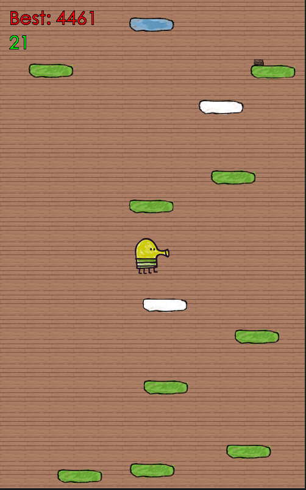

# Doodle Jump

A C++17/SFML recreation of Doodle Jump, originally built for an advanced
programming course.

<p align="center">
  
</p>

## Features

- Static, horizontal, vertical, and disappearing platforms
- Spring and jetpack power-ups
- Responsive arcade movement with automatic jumping
- A mathematically reachable climbing path with optional challenge platforms
- Gradually increasing difficulty based on score
- Sound effects, sprites, and a persistent best score during a session
- CMake build with automatic SFML fallback through FetchContent

## Controls

- `A` or `Left Arrow`: move left
- `D` or `Right Arrow`: move right
- Close the window to quit

The character jumps automatically when landing on a platform.

## Build

You need a C++17 compiler and CMake 3.20 or newer. If SFML is not installed,
CMake downloads SFML 2.6.2 automatically.

```bash
cmake -S . -B build
cmake --build build --config Release
ctest --test-dir build --output-on-failure
```

Run the executable from `build/bin`. The build copies the required assets next
to the executable automatically.

On multi-config generators such as Visual Studio, the executable may be inside
`build/bin/Release`.
